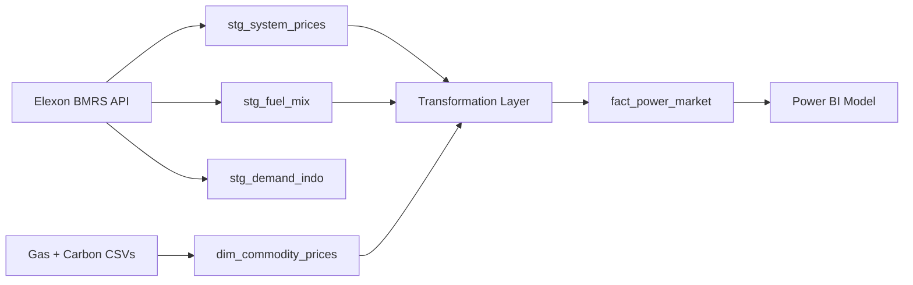

# GB Power Market Pipeline 

A small end-to-end data project exploring balancing prices, renewable penetration, and thermal generation economics in the GB power market.

The pipeline pulls data from Elexon BMRS and commodity price inputs, transforms it into a clean settlement-period dataset, and serves a single fact table for analysis in Power BI.

The project focuses on how intraday price shape, wind penetration, and clean spark spreads interact across different market conditions.

For the interactive dashboards and analysis, see the Projects section of my portfolio website:

callumhughesportfolio.netlify.app

## Architecture Overview

The pipeline follows a simple 3-layer shape:

- `staging` tables: raw-normalized BMRS and commodity data
- `transformation` logic: unit conversion and market signal calculations
- `serving` table: one Power BI-ready fact table

Core files:

- `scripts/fetch_data.py` -> pulls BMRS data into staging tables
- `scripts/load_commodity_prices.py` -> loads gas/carbon prices into commodity dimension
- `scripts/build_powerbi_fact.py` -> builds and validates `fact_power_market`
- `scripts/calculate_spreads.py` -> core spread and wind-share calculations
- `data/build_powerbi_fact.sql` -> SQL equivalent materialization logic
- `data/migration_v2.sql` -> migration from old schema/table names

## Data Flow

## Why Settlement Periods Matter (GB Context)

GB balancing and imbalance prices are settled per settlement period (SP), not as one daily average. If the key is only `date`, you lose intraday shape, volatility, and scarcity signals. 

## Endpoint and Dataset Logic

- **System Prices** (`balancing/settlement/system-prices/{date}`): delivers `SBP`/`SSP`, key balancing signals.
- **FUELINST** (`datasets/FUELINST`): generation by fuel type; used to compute `wind_pct`.
- **INDO demand forecast** (`datasets/INDO`): operational demand context for supply-demand tightness.

## Unified Naming Convention

All transformed tables use:

- snake_case
- explicit units in field names
- stable composite key: (`date`, `settlement_period`) for SP-level time series

Examples:

- `sbp_gbp_mwh`, `ssp_gbp_mwh`
- `gas_p_per_therm`, `gas_gbp_mwh`
- `carbon_eur_per_tco2`, `carbon_gbp_mwh`
- `spark_spread_gbp_mwh`, `clean_spark_spread_gbp_mwh`

## Spread Formulas and Unit Logic

### 1) Gas conversion

- Input: `gas_p_per_therm`
- Convert to GBP/therm: `gas_p_per_therm / 100`
- Convert to GBP/MWh(th): `(gas_p_per_therm / 100) / 0.0293071`

### 2) Carbon conversion

- Input: `carbon_eur_per_tco2`
- Convert to GBP/MWh(e): `carbon_eur_per_tco2 * eur_gbp * emissions_factor_tco2_per_mwh`
- Default emissions factor in project: `0.36 tCO2/MWh`

### 3) Spark spreads

- Spark spread: `SBP - (gas_gbp_mwh * heat_rate)`
- Clean spark spread: `spark_spread - carbon_gbp_mwh`

## Power BI Fact Table

`fact_power_market` columns:

- `date`
- `settlement_period`
- `sbp_gbp_mwh`
- `ssp_gbp_mwh`
- `wind_pct`
- `gas_gbp_mwh`
- `carbon_gbp_mwh`
- `spark_spread_gbp_mwh`
- `clean_spark_spread_gbp_mwh`

